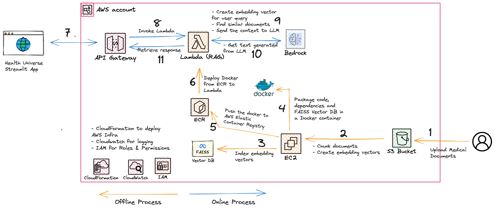

# Generative AI Medical Application Backend

## Introduction
In the age of information, the medical field is constantly evolving. With the rise of holistic and integrative approaches to health, there's a growing need to cross-reference conventional medical knowledge with natural and herbal therapies. The HealthUniverse Hackathon presented an opportunity to address this need, leading to the development of our Generative AI Medical Application.

This repo covers two approaches:
* Meta Llama2 LLM model deployed on <a href="https://github.com/rmadabusiml/mediverse-api/blob/main/api/app/api/api_v1/endpoints/initialize.py#L117" target="_blank">SageMaker endpoint</a> via SageMaker Jumpstart 
* Anthropic Claude V2 model deployed on <a href="https://github.com/rmadabusiml/mediverse-api/blob/main/api/app/api/api_v1/endpoints/initialize.py#L131" target="_blank">AWS Bedrock endpoint</a>

## High-level Design

## Architecture with SageMaker JumpStart

## Architecture with AWS Bedrock

## Demo Video

