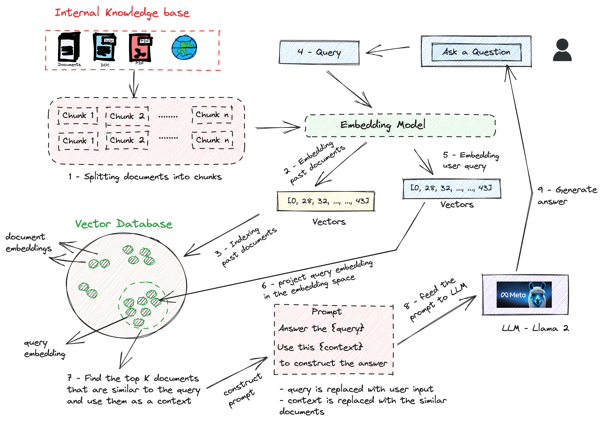
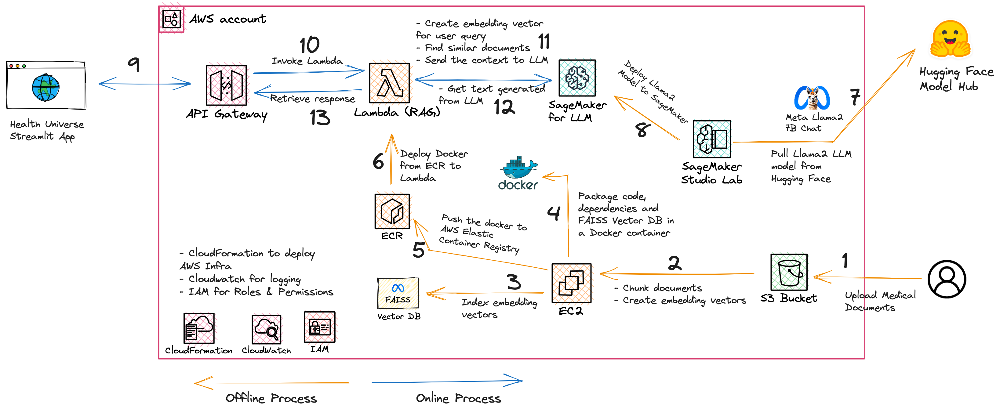
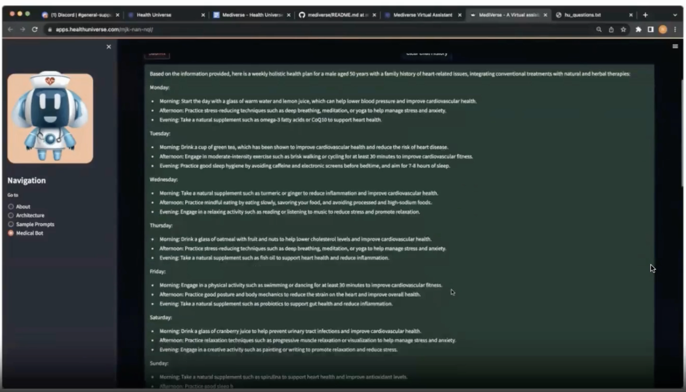

# Generative AI Medical Application Backend

## Introduction
In the age of information, the medical field is constantly evolving. With the rise of holistic and integrative approaches to health, there's a growing need to cross-reference conventional medical knowledge with natural and herbal therapies. The HealthUniverse Hackathon presented an opportunity to address this need, leading to the development of our Generative AI Medical Application.

## High-level Design

## Architecture

## Demo Video

